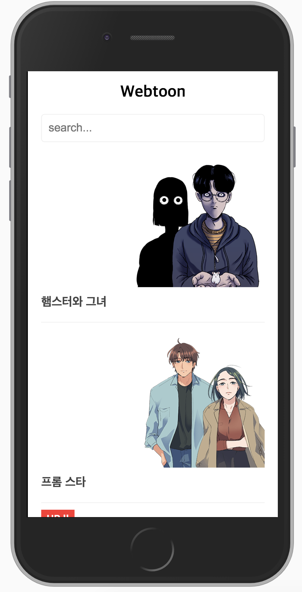

# Simple Example Webtoon

## 목표

간단한 SPA 페이지를 구성해본다.

## 학습

- Component 기반의 구조에 익숙해진다.
- State 와 Props 를 다뤄본다.
- [부모와 자식간의 Event 를 다뤄본다.](https://kr.vuejs.org/v2/guide/events.html)
- [Condition 에 따라 렌더링을 결정한다.](https://kr.vuejs.org/v2/guide/conditional.html)
- [Component 를 Loop 를 이용하여 반복하여 렌더링해본다](https://kr.vuejs.org/v2/guide/list.html)
- [조건에 따라 class 를 추가한다](https://kr.vuejs.org/v2/guide/class-and-style.html)

## 결과

